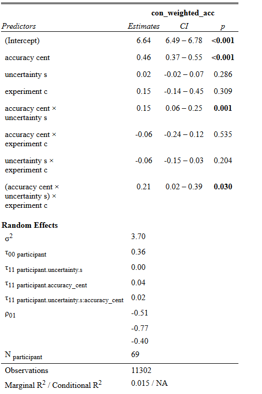
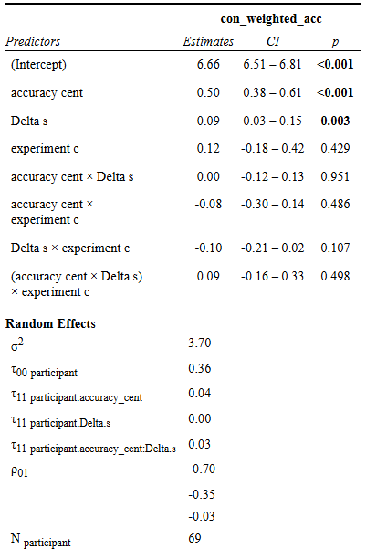
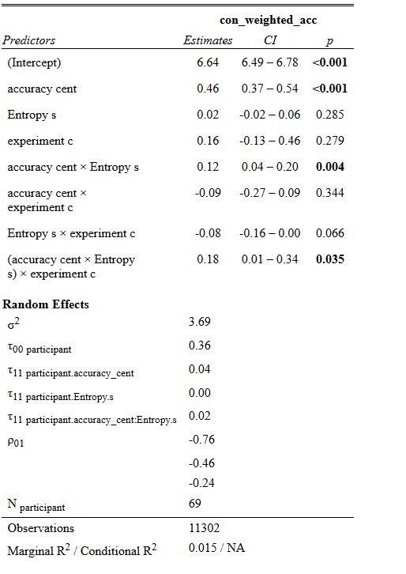

```{r setup}
#| echo: false
#| warning: false
#| message: false

rm(list=ls())

knitr::opts_chunk$set(include = F, message = FALSE)
# Define the list of required packages

required_packages <- c("dplyr", "ggplot2", "tidyr", "lme4", 
                     "car", "sjPlot", "Rmisc", "patchwork", 
                     "tidyverse", "ggeffects")
                     
# Check which packages are not installed
missing_packages <- required_packages[!(required_packages %in% installed.packages()[,"Package"])]

# Install missing packages
if (length(missing_packages)) {
  install.packages(missing_packages)
}

# Optionally load all packages
suppressPackageStartupMessages({
  invisible(
lapply(required_packages, library, character.only = TRUE)
)
})
```

## 

This document contains the analyses of the model-derived variables for PREMCE-computational for both the behavioral and the fMRI data combined

## RL models

Several reinforcement learning models were fitted to the data using hierarchical bayesian estimation.\
The model differed depending on the following factors:

- **Choice-dependent vs Observational models**.\
  For the choice-dependent models , the categories were updated based on the choice made by the participant.\
  For single-update models (SU), only the category chosen by the participant is updated:

$$    {V}_{t+1}^{c,m}= {V}_t^{c,m} + {\alpha}{\delta},$$

where ${V}_{t+1}^{c,m}$ represents the expected value at the next trial for category *c* and monster *m*. The prediction error $\delta$ is given by:

$${\delta} = {r}_t^c - {V}_t^{c,m},$$

## RL models

In choice- dependent models, the prediction error is defined as the following:

$$\delta_t = \begin{cases}
1 - {V}_t^{c,m} \ if  c_{chosen_t} = c_t   \\ 
0 - {V}_t^{c,m} \ otherwise
\end{cases}$$

For the dual-update models (DU), the unchosen category is also updated.

## RL models

By contrast, the observational models (also called IC), were updated depending on the category of the object that is presented on every trial. Accordingly, the reward $r_t^c$ is defined as the following:

$$r_t^c = \begin{cases}
1\ if  \ c = c_{object_t}  \\ 
0 \ otherwise
\end{cases}$$

The model assumes that individuals are not only increasing the value of a given category after observing an outcome, but they will also decrease the values of the categories that have not been presented on that trial.

- **Single or double learning rate**.\
  The models estimated either one learning rate across all the trials, or differentiate between a learning rate for the chosen vs unchosen category (for the choice-dependent models) or the observed vs unobserved category (for the observational models).

## Model comparison

A win-stay-lose-shift (WSLS) model was also fitted as a baseline model for comparison

WAIC (widely Applicable Information Criterion) is used to approximate cross-validation with the *loo* package. The package also estimates the expected log predictive density, given the data, leaving one sample out (elpd_loo). The higher the elpd_loo (and the lower the WAIC), the better the model. THis table shows that the observational model with 2 learning rates (waic_fit_hBayes_RW_IC_2alpha_beta) slightly outperform the observational model with only one learning rate (waic_fit_hBayes_RW_IC_alpha_beta)

## Model comparison

| Model Name                   | elpd_diff | se_diff | waic    |
|------------------------------|-----------|---------|---------|
| RW_IC_2alpha_beta            | 0.0       | 0.0     | 22317.8 |
| RW_IC_alpha_beta             | -43.2     | 26.8    | 22404.2 |
| RW_SU_alphapos_alphaneg_beta | -1432.8   | 185.4   | 25183.5 |
| RW_SU_alpha_beta             | -2191.5   | 310.8   | 26700.7 |
| RW_DU_alpha_beta             | -2660.2   | 204.1   | 27638.2 |
| WSLS                         | -6682.1   | 515.1   | 35682.0 |

## Model comparison

This result is similar if we use stacking, which computes the difference between the loo-predicted and the actual data, and assign a weight to each model. The higher the weight, the smaller the error between the predicted and actual data.

Method: stacking

| Model Name                          | weight |
|-------------------------------------|--------|
| hBayes_RW_DU_alpha_beta             | 0.000  |
| hBayes_RW_IC_alpha_beta             | 0.328  |
| hBayes_RW_IC_2alpha_beta            | 0.637  |
| hBayes_RW_SU_alpha_beta             | 0.000  |
| hBayes_RW_SU_alphapos_alphaneg_beta | 0.035  |
| hBayes_WSLS                         | 0.000  |

```{r}
#| echo: false
# load the data separaterly. 
# first, load the behavioral

source("R/1.preprocess_beh.R")
```

## Parameter estimation

Parameters of best fit are estimated after the winning model is fit to the data.

These is the distribution of the estimated parameters

## 

```{r}
#| echo: false
# exclude the 9
list.files()
# distribution of parameters
param<-read.csv("estimated_parameters_mcmc_RW_IC_2alpha_beta.csv")

names(param)[4]<-"study"

alphaposdist<-ggplot(param, aes(x= alphapos, color = study, fill = study))+geom_density(alpha = 0.3)+ 
  ggtitle("alpha for the observed category")+
  theme_classic()


alphanegdist<-ggplot(param, aes(x= alphaneg, color = study, fill = study))+
  geom_density(alpha = 0.3)+ 
  ggtitle("alpha for the unobserved categories")+
  theme_classic()


betadistr<-ggplot(param, aes(x= beta,color = study, fill = study))+geom_density(alpha = 0.3)+ 
  ggtitle("beta")+
  theme_classic()


print((alphaposdist+alphanegdist)/betadistr)


```

## Parameter estimation

This graph shows the expected value for each category, in a participant from the behavioral sample

```{r}
#| echo: false
print(
ggplot(RLdata_beh[RLdata_beh$participant==25,], aes(x=new_trial_n))+
  
  geom_line(aes(y=V1), size = 1.5, color = "blue")+
  geom_line(aes(y=V2),size = 1.5, color = "darkgreen")+
  geom_line(aes(y=V3),size = 1.5, color = "brown")+
  geom_line(aes(y=V4), size = 1.5,color = "orange")+
  # geom_line(aes(y=Delta), color = "red")+
  
  
  geom_vline(xintercept = c(49, 97,145))+
  #facet_grid(butterfly~SubNum)+
  theme_classic()+
  facet_grid(cuedCharacter~.,labeller = labeller(cuedCharacter = c("Character 1", "Character 2")))+
  ylab("Expected values")
)
```

```{R}
#| echo: false

# generate quantities aand attach memory
source("R/2.Comp_and_memory_beh.R")

```

## Paremeter estimation

And this is an example of a participant from the fMRI sample. Note that there is additional change point in the paradigm

```{r}
#| echo: false

# now do the same for the fMRI data

#RLdata<-read.csv(paste(abs, "output_files/RLdata_RW_IC.csv", sep=""))
RLdata_fmri<-read.csv( "output_files/fmri/RL_data_RW_IC_2alpha_beta_beh_mcmc.csv")

RLdata_fmri$character<-substr(RLdata_fmri$cuedCharacter, 9, 10)

# delete the practice
#RLdata_fmri<-RLdata_fmri[is.na(RLdata_fmri$pract_resp.keys),]


count_trials<- RLdata_fmri %>%
  group_by(participant, switch_cond) %>%
  tally()

RLdata_fmri<-RLdata_fmri[order(RLdata_fmri$participant),]

# in RL data, cut all the trial before the 16th and trial cond==1
#RLdata<-RLdata[RLdata$trialNum>16 & RLdata$trial_cond==1,]
RLdata_fmri$image<-as.character(RLdata_fmri$image)

# now we need the recognition data
recogData_fmri<-read.csv("recog_data/recognitionData_fmri.csv")

recogData_fmri$image<-as.character(recogData_fmri$image)

RLdata_fmri$image<-substr(RLdata_fmri$image, 17, nchar(RLdata_fmri$image))
recogData_fmri$image<-substr(recogData_fmri$image, 17, nchar(recogData_fmri$image))
#RLdata$confidence<-recogData$confidence
# plot the estimated probabilities for each murk

ggplot(RLdata_fmri[RLdata_fmri$participant==7,], aes(x=trialNum))+
  
  geom_line(aes(y=V1), size = 1.5, color = "blue")+
  geom_line(aes(y=V2),size = 1.5, color = "darkgreen")+
  geom_line(aes(y=V3),size = 1.5, color = "brown")+
  geom_line(aes(y=V4), size = 1.5,color = "orange")+
  # geom_line(aes(y=Delta), color = "red")+
  
  
  # geom_vline(xintercept = c(18, 55,90, 126))+
  #facet_grid(butterfly~SubNum)+
  theme_classic()+
  facet_grid(cuedCharacter~.,labeller = labeller(cuedCharacter = c("Character 1", "Character 2")))+
  ylab("Expected Value")


```

```{R}
#| include: false
# generate quantities aand attach memory
source("R/3.Comp_and_memory_fmri.R")
```

```{r bind dataset}
#| include: false
#------------------------------------------------------------------------------#
# bind dataset
# assign participant to the fmri as participant +100, to not create participants 
# duplicates

RL_data_f$participant<-RL_data_f$participant+100
RL_data_f$experiment<-2

RL_data_b$changePoint<-ifelse(RL_data_b$befAft=="afterCP", 1, 0)

RL_data_b$experiment<-1

var_to_del<-names(RL_data_f)[!names(RL_data_f) %in% names(RL_data_b)]

RL_data_f<-RL_data_f[,!names(RL_data_f) %in% var_to_del]

# delete the confidence in the RL data behavioral
RL_data_b<-RL_data_b[,!names(RL_data_b) %in% "confidence"]

# now bind the two
RLdata<-rbind(RL_data_b, RL_data_f)

# delete the practice in the beh
#RLdata<-RLdata[RLdata$switch_cond>1, ]


```

## Computationally-derived variables

Two variables were derived from the best-fitting model:\
- Uncertainty:

$$\text{Uncertainty}_t = \frac{1}{\operatorname{var}(V^{1}_t, V^{2}_t, V^{3}_t, V^{4}_t)}$$ - Prediction error Prediction error is defines as:

- Entropy (H):

$$H(S_t) = -\sum_{i=1}^4  (P^{m=i}_t)log(P^{m=i}_t)$$ Both quantities are at their heighest when the distribution of the expected values is more uniform.

## Computationally-derived variables

Both quantities were scaled and centered within- participants.

```{r}
#| include: false
# scale entropy and surprise
#

# RLdatascaledcent<-RLdata %>%
#   group_by(participant) %>%
#   mutate(mean_expV = mean(expV, na.rm=T), 
#          mean_expVpre = mean(expVpre, na.rm = T),
#          mean_updateV = mean(updateV, na.rm=T), 
#          mean_update = sd(update, na.rm = T),
#          mean_updateAll = mean(updateAll, na.rm=T),
#          mean_uncertainty = mean(uncertainty, na.rm=T),
#          mean_Delta = mean(Delta, na.rm=T),
# 
#          sd_expV = sd(expV, na.rm = T),
#          sd_expVpre = sd(expVpre, na.rm = T),
#          sd_update = sd(update, na.rm = T),
#          sd_updateV = sd(updateV, na.rm = T),
#          sd_updateAll = sd(updateAll, na.rm = T),
#          sd_uncertainty = sd(uncertainty, na.rm=T),
#          sd_Delta =  sd(Delta, na.rm=T)
#   ) %>%
#   ungroup() %>%
#   mutate(expV.s = (expV-mean_expV)/sd_expV,
#          expVpre.s = ( expVpre-mean_expVpre)/sd_expVpre,
#          update.s = (update-mean_update)/sd_update,
#          updateV.s = (updateV-mean_updateV)/sd_updateV,
#          updateAll.s = (updateAll-mean_updateAll)/sd_updateAll, 
#          uncertainty.s = (uncertainty-mean_uncertainty)/sd_uncertainty,
#          Delta.s = (Delta-mean_Delta)/sd_Delta)

RLdatascaledcent <- RLdata %>%
  group_by(participant) %>%
  # compute person means & sds for the target variables
  dplyr::mutate(
    mean_expV         = mean(expV,         na.rm = TRUE),
    mean_expVpre      = mean(expVpre,      na.rm = TRUE),
    mean_updateV      = mean(updateV,      na.rm = TRUE),
    mean_update       = mean(update,       na.rm = TRUE),   # <-- fixed
    mean_updateAll    = mean(updateAll,    na.rm = TRUE),
    mean_uncertainty  = mean(uncertainty,  na.rm = TRUE),
    mean_Delta        = mean(Delta,        na.rm = TRUE),
    mean_Delta_chosen = mean(Delta_chosen, na.rm = TRUE),
    mean_Entropy      = mean(entropy_preP, na.rm = TRUE),
    
    sd_expV           = sd(expV,           na.rm = TRUE),
    sd_expVpre        = sd(expVpre,        na.rm = TRUE),
    sd_updateV        = sd(updateV,        na.rm = TRUE),
    sd_update         = sd(update,         na.rm = TRUE),
    sd_updateAll      = sd(updateAll,      na.rm = TRUE),
    sd_uncertainty    = sd(uncertainty,    na.rm = TRUE),
    sd_Delta          = sd(Delta,          na.rm = TRUE),
    sd_Delta_chosen   = sd(Delta_chosen,   na.rm = TRUE),
    
    sd_Entropy        = sd(entropy_preP, na.rm = TRUE)
  ) %>%
  ungroup() %>%
  
  dplyr:: mutate(
    expV.s        = (expV        - mean_expV)        / ifelse(sd_expV        > 0, sd_expV,        NA_real_),
    expVpre.s     = (expVpre     - mean_expVpre)     / ifelse(sd_expVpre     > 0, sd_expVpre,     NA_real_),
    update.s      = (update      - mean_update)      / ifelse(sd_update      > 0, sd_update,      NA_real_),
    updateV.s     = (updateV     - mean_updateV)     / ifelse(sd_updateV     > 0, sd_updateV,     NA_real_),
    updateAll.s   = (updateAll   - mean_updateAll)   / ifelse(sd_updateAll   > 0, sd_updateAll,   NA_real_),
    uncertainty.s = (uncertainty - mean_uncertainty) / ifelse(sd_uncertainty > 0, sd_uncertainty, NA_real_),
    Delta.s       = (Delta       - mean_Delta)       / ifelse(sd_Delta       > 0, sd_Delta,       NA_real_), 
    Delta_chosen.s= (Delta_chosen- mean_Delta_chosen)/ ifelse(sd_Delta_chosen> 0, sd_Delta_chosen,NA_real_), 
    Entropy.s     = (entropy_preP -mean_Entropy)     /ifelse(sd_Entropy      >0 , sd_Entropy,     NA_real_)
  )

#   )


```

## Computationally-derived variables

- Uncertainty , PE , entropy, across trials

```{r}


ggplot(RLdatascaledcent[RLdatascaledcent$participant==107 &
                          RLdatascaledcent$switch_cond>2,], aes(x=trialNum))+
  
  geom_line(aes(y=V1), size = 1, color = "blue", alpha = 0.3)+
  geom_line(aes(y=V2),size = 1, color = "darkgreen", alpha = 0.3, )+
  geom_line(aes(y=V3),size = 1, color = "brown", alpha=0.3)+
  geom_line(aes(y=V4), size = 1,color = "orange", alpha=0.3)+
  geom_line(aes(y=uncertainty.s, color = "Uncertainty"),size = 1,alpha = 0.8)+
  geom_line(aes(y=Delta.s, color = "Prediction Error"), alpha =0.5,size = 1)+
  geom_line(aes(y=Entropy.s, color = "Entropy"), alpha =0.5,size = 1)+

  
  # geom_line(aes(y=Delta), color = "red")+
  
  
  # geom_vline(xintercept = c(18, 55,90, 126))+
  #facet_grid(butterfly~SubNum)+
  theme_classic()+
  #facet_grid(cuedCharacter~.,labeller = labeller(cuedCharacter = c("Character 1", "Character 2")))+
  ylab("")+
  scale_color_manual(
    name = "",
    values = c(
     # "Option 1" = "blue",
      #"Option 2" = "darkgreen",
      #"Option 3" = "brown",
      #"Option 4" = "orange",
      "Uncertainty" = "black",
      "Prediction Error" = "red", 
      "Entropy" = "orange"

    )
  ) +
  
  theme_classic() +
facet_grid(cuedCharacter ~ .)
```

## Computationally-derived variables

- Uncertainty was higher after the CP, for all participants but one.

```{r}


RLdatascaledcent$changePoint<-as.character(RLdata$changePoint)

uncerainty_plot<-ggplot(RLdatascaledcent, aes(changePoint, uncertainty.s))+ 
  geom_bar(aes(changePoint, uncertainty.s, fill = changePoint),
           position="dodge",stat="summary", fun.y="mean", SE=T)+
  scale_fill_manual("legend", values = c("1" = "darkgoldenrod1", "0" = "darkred"))+
  stat_summary(fun.data = "mean_cl_boot", size = 0.8, geom="errorbar", width=0.2 )+
  #geom_jitter( size=1,width=0.1)+
  theme(axis.text.x = element_blank())+# we are showing the different levels through the colors, so we can avoid naming the bars
  theme(axis.ticks.x = element_blank())+
  
  xlab("Trial Position")+
  scale_x_discrete(labels = c('Before CP','After CP'))+
  theme(axis.title=element_text(size=14,face="bold"))+
  theme_classic()+
  facet_grid(.~experiment)+
  theme(strip.text.x = element_text(size = 13))+ 
  ylab("Uncertainty")+
  geom_line(data = RLdatascaledcent, aes(changePoint, uncertainty.s, group = participant), size=1, alpha=0.2, stat="summary")+
  #coord_cartesian(ylim=c(6,7.5))+ # xlab("feedback")+
  
  theme(axis.text.x = element_text( size = 20))+
  theme(axis.title=element_text(size=14,face="bold"))+
  theme(axis.text.x = element_text( size = 20))+
  theme(axis.title=element_text(size=14,face="bold"))+
  theme(legend.position = "none")+
  theme(plot.title = element_text(hjust = 0.5))+
  theme(legend.position = "none")
```

- Entropy and PE were higher after the change point for all participants.

```{r}
entropy_plot<-ggplot(RLdatascaledcent, aes(changePoint, Entropy.s))+ 
  geom_bar(aes(changePoint, Entropy.s, fill = changePoint),
           position="dodge",stat="summary", fun.y="mean", SE=T)+
  scale_fill_manual("legend", values = c("1" = "darkgoldenrod1", "0" = "darkred"))+
  stat_summary(fun.data = "mean_cl_boot", size = 0.8, geom="errorbar", width=0.2 )+
  #geom_jitter( size=1,width=0.1)+
  theme(axis.text.x = element_blank())+# we are showing the different levels through the colors, so we can avoid naming the bars
  theme(axis.ticks.x = element_blank())+
  
  xlab("Trial Position")+
  scale_x_discrete(labels = c('Before CP','After CP'))+
  theme(axis.title=element_text(size=14,face="bold"))+
  theme_classic()+
  facet_grid(.~experiment)+
  theme(strip.text.x = element_text(size = 13))+ 
  ylab("Entropy")+
  geom_line(data = RLdatascaledcent, aes(changePoint, Entropy.s, group = participant), size=1, alpha=0.2, stat="summary")+
  #coord_cartesian(ylim=c(6,7.5))+ # xlab("feedback")+
  
  theme(axis.text.x = element_text( size = 20))+
  theme(axis.title=element_text(size=14,face="bold"))+
  theme(axis.text.x = element_text( size = 20))+
  theme(axis.title=element_text(size=14,face="bold"))+
  theme(legend.position = "none")+
  theme(plot.title = element_text(hjust = 0.5))+
  theme(legend.position = "none")

#plot(uncerainty_plot+entropy_plot)


PE_plot<-ggplot(RLdatascaledcent, aes(changePoint, Delta.s))+ 
  geom_bar(aes(changePoint, Delta.s, fill = changePoint),
           position="dodge",stat="summary", fun.y="mean", SE=T)+
  scale_fill_manual("legend", values = c("1" = "darkgoldenrod1", "0" = "darkred"))+
  stat_summary(fun.data = "mean_cl_boot", size = 0.8, geom="errorbar", width=0.2 )+
  #geom_jitter( size=1,width=0.1)+
  theme(axis.text.x = element_blank())+# we are showing the different levels through the colors, so we can avoid naming the bars
  theme(axis.ticks.x = element_blank())+
  
  xlab("Trial Position")+
  scale_x_discrete(labels = c('Before CP','After CP'))+
  theme(axis.title=element_text(size=14,face="bold"))+
  theme_classic()+
  facet_grid(.~experiment)+
  theme(strip.text.x = element_text(size = 13))+ 
  ylab("Prediction Error")+
  geom_line(data = RLdatascaledcent, aes(changePoint, Entropy.s, group = participant), size=1, alpha=0.2, stat="summary")+
  #coord_cartesian(ylim=c(6,7.5))+ # xlab("feedback")+
  
  theme(axis.text.x = element_text( size = 20))+
  theme(axis.title=element_text(size=14,face="bold"))+
  theme(axis.text.x = element_text( size = 20))+
  theme(axis.title=element_text(size=14,face="bold"))+
  theme(legend.position = "none")+
  theme(plot.title = element_text(hjust = 0.5))+
  theme(legend.position = "none")

plot(uncerainty_plot+PE_plot+entropy_plot)
```

The two columns indicate the experiment (1 = behavioral, 2 = fMRI)

## Memory - Uncertainty

The effect of these variables on memory was then analyzed. There was a three-way interaction between accuracy, uncertainty, and experiment:



```{r}

#| echo: false

RLdatascaledcent$experiment.c<-ifelse(RLdatascaledcent$experiment==1, -0.5, 0.5)

# scaled and centered within
RLdatascaledcent$accuracy_cent<-ifelse(RLdatascaledcent$accuracy==0, -0.5, 0.5)

modupdate_acc_unc<-lmer(con_weighted_acc~(accuracy_cent*uncertainty.s*experiment.c)+
                          (uncertainty.s*accuracy_cent|participant), 
                        data=RLdatascaledcent,
                        control=lmerControl(optimizer="bobyqa",optCtrl=list(maxfun=100000)))

tab_model(modupdate_acc_unc)


```

## Memory - Uncertainty

The plot shows that the interaction between prediction accuracy and uncertainty is stronger in the fMRI study (experiment_c = 0.5)

```{r}
# Pick a few meaningful accuracy values (change to what you want)
pred_uncertainty <- ggpredict(
  modupdate_acc_unc,
  terms = c(
    "uncertainty.s [all]",          # x-axis
    "accuracy_cent[-0.5, 0.5]",     # colored lines (3 levels)
    "experiment.c"                 # facets
  )
)

ggplot(pred_uncertainty, aes(x = x, y = predicted, color = group, fill = group)) +
  geom_ribbon(aes(ymin = conf.low, ymax = conf.high), alpha = 0.15, colour = NA) +
  geom_line(linewidth = 1) +
  facet_wrap(~ facet, labeller = label_both) +
  labs(x = "Uncertainty", y = "Predicted con_weighted_acc",
       color = "Accuracy", fill = "Accuracy") +
  theme_classic()
```

## Memory - Prediction error

The effect of prediction error was then analyzed

```{r}
mod_PE_acc<-lmer(con_weighted_acc~accuracy_cent*Delta.s*experiment.c+
                   (accuracy_cent*Delta.s|participant), 
                 data=RLdatascaledcent,
                 control=lmerControl(optimizer="bobyqa",optCtrl=list(maxfun=100000)))


sjPlot::tab_model(mod_PE_acc)


```

There was a there was a main effect of PE: 

```{r}
# delta chosen
# mod_PE_chosen_acc<-lmer(con_weighted_acc~accuracy_cent*Delta_chosen.s*experiment.c+
#                           (accuracy_cent*Delta_chosen.s|participant), 
#                         data=RLdatascaledcent[ RLdatascaledcent$switch_cond!=1,],
#                         control=lmerControl(optimizer="bobyqa",optCtrl=list(maxfun=100000)))
# 
# tab_model(mod_PE_chosen_acc)
# 
# vif(mod_PE_chosen_acc)
```

## Memory and prediction error8

```{r}
# Pick a few meaningful accuracy values (change to what you want)
pred_PE<- ggpredict(
  mod_PE_acc,
  terms = c(
    "Delta.s [all]",          # x-axis
    "accuracy_cent[-0.5, 0.5]",     # colored lines (3 levels)
    "experiment.c"                 # facets
  )
)

ggplot(pred_PE, aes(x = x, y = predicted, color = group, fill = group)) +
  geom_ribbon(aes(ymin = conf.low, ymax = conf.high), alpha = 0.15, colour = NA) +
  geom_line(linewidth = 1) +
  facet_wrap(~ facet, labeller = label_both) +
  labs(x = "PE", y = "Predicted con_weighted_acc",
       color = "Accuracy", fill = "Accuracy") +
  theme_classic()
```

As we can see from the graph, the effect was strong in the behavioral but not in the fmri study

# PE and uncertainty

```{r}
#| echo: false


modupdate_acc_unc_PE<-lmer(con_weighted_acc~(accuracy_cent*uncertainty.s*experiment.c)+ 
                          (accuracy_cent*Delta.s*experiment.c)+
                          (uncertainty.s+Delta.s+accuracy_cent+
                             uncertainty.s:accuracy_cent+Delta.s:accuracy_cent|participant), 
                        data=RLdatascaledcent,
                        control=lmerControl(optimizer="bobyqa",optCtrl=list(maxfun=100000)))

tab_model(modupdate_acc_unc_PE)
Anova(modupdate_acc_unc_PE, type =3)
vif(modupdate_acc_unc_PE)
```

```{r}
## Memory - Entropy

modupdate_acc_entr<-lmer(con_weighted_acc~accuracy_cent*Entropy.s*experiment.c+
                           (accuracy_cent*Entropy.s|participant), 
                         data=RLdatascaledcent,
                         control=lmerControl(optimizer="bobyqa",optCtrl=list(maxfun=100000)))

tab_model(modupdate_acc_entr)


```

In a similar direction, there was an interaction between accuracy, entropy and experiment: 

## Memory - Entropy

```{r}
#| echo: false
pred_entropy <- ggpredict(
  modupdate_acc_entr,
  terms = c(
    "Entropy.s [all]",          # x-axis
    "accuracy_cent[-0.5, 0.5]",     # colored lines (3 levels)
    "experiment.c"                 # facets
  )
)

ggplot(pred_entropy, aes(x = x, y = predicted, color = group, fill = group)) +
  geom_ribbon(aes(ymin = conf.low, ymax = conf.high), alpha = 0.15, colour = NA) +
  geom_line(linewidth = 1) +
  facet_wrap(~ facet, labeller = label_both) +
  labs(x = "Entropy", y = "Predicted con_weighted_acc",
       color = "Accuracy", fill = "Accuracy") +
  theme_classic()
```

## Correlation between PE and uncertainty

```{r}
modupdate_uncertainty_PE<-lmer(uncertainty.s~Delta.s*experiment.c+
                           (Delta.s|participant), 
                         data=RLdatascaledcent,
                         control=lmerControl(optimizer="bobyqa",optCtrl=list(maxfun=100000)))

tab_model(modupdate_uncertainty_PE)

```

```{r}
uncertainty_PE<- ggpredict(
  modupdate_uncertainty_PE,
  terms = c(
    "Delta.s [all]",          # x-axis
    "experiment.c"                 # facets
  )
)

ggplot(uncertainty_PE, aes(x = x, y = predicted)) +
  geom_ribbon(aes(ymin = conf.low, ymax = conf.high), alpha = 0.15, colour = NA) +
  geom_line(linewidth = 1) +
  facet_wrap(~ group, labeller = label_both) +
  labs(x = "Uncertainty", y = "Predicted PE")+
  theme_classic()
```
